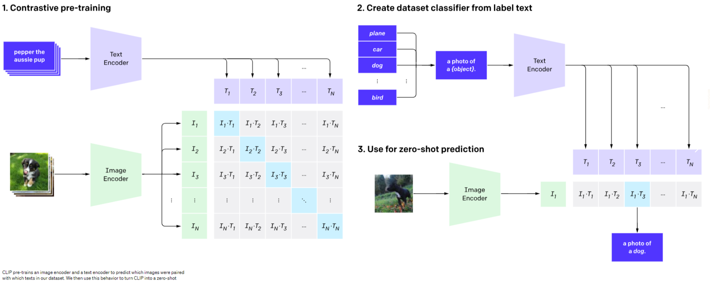

# CLIP

github源码：[openai/CLIP: CLIP (Contrastive Language-Image Pretraining), Predict the most relevant text snippet given an image (github.com)](https://github.com/openai/CLIP)

## 1.前言：什么是CLIP

​	2021开年，顶着地表最强语言模型GPT-3的光环，OpenAI在自然语言处理领域一路高歌猛进，推出两个跨越文本与图像次元的模型：DALL·E和CLIP，前者可以基于文本生成图像，后者则可以基于文本对图片进行分类，两者都意在打破自然语言处理和计算机视觉两大门派“泾渭分明”的界限，实现多模态AI系统。CLIP是一个预训练模型，就像BERT、GPT、ViT等预训练模型一样。首先使用大量无标签数据训练这些模型，然后训练好的模型就能实现，输入一段文本（或者一张图像），输出文本（图像）的向量表示。CLIP和BERT、GPT、ViT的区别在于，CLIP是多模态的，包含图像处理以及文本处理两个方面内容，而BERT、GPT是单文本模态的，ViT是单图像模态的。

​	CLIP 全称 Contrastive Language-Image Pre-training，具有十分强悍的迁移学习能力，为了佐证这个能力，在超过 30 多个视觉数据上进行测试，涵盖面十分广泛，包括 OCR、视频动作检测、坐标定位和许多细分类任务，在所有的结果中最炸裂的一条就是在 ImageNet 上的结果，CLIP 在不使用任意一张 ImageNet 图片训练的情况下，直接 Zero-Shot 推理，就能获得跟之前有监督训练的 ResNet-50 同样优秀的结果，Clip模型还可以用于图像生成、图像检索、视觉问答、视频理解等任务，因此对多模态学习中具体深刻的历史意义。

### 1.1CLIP模型的优势和劣势

CLIP模型具有以下优势：

（1）无监督或弱监督的学习方法：CLIP模型采用了对比学习和预训练的方法，使得模型能够在大规模无标注数据上进行训练，并学习到具有良好泛化能力的特征表示，因此不需要大量标注数据。

（2）泛化能力强：CLIP模型能够学习到具有良好泛化能力的特征表示，并在多项视觉和语言任务中取得了优异的性能。

（3）可解释性好：CLIP模型使用了一个基于Transformer的编码器，能够对输入的图像和文本进行编码，并输出对应的特征表示，因此具有很好的可解释性。

CLIP模型的劣势在于：

（1）计算资源消耗大：由于CLIP模型采用了大规模无标注数据进行训练，并使用了较大的模型，因此需要大量计算资源进行训练和推理。

## 2.什么是zero-shot

​	举个通俗的例子：假设斑马是未见过的类别，但根据描述和过去知识的印象即马（和马相似）、老虎（有条纹）、熊猫（颜色）相似进行推理出斑马的具体形态，从而能对新对象进行辨认。（如下图所示）零次学习就是希望能够模仿人类的这个推理过程，使得计算机具有识别新事物的能力。


​	这是zero-shot介绍时常用的一张图，从见过的类别（第一列）中提取特征（如：外形像马、条纹、黑白），然后根据对未知类别特征的描述，测试未见过的类别。

​	从字面上来看，**即是对某（些）类别完全不提供训练样本，也就是没有标注样本的迁移任务被称为零次学习。** zero-shot learning是为了能够识别在测试中出现，但在训练中没有遇到过的数据类别，我们可以学习到一个映射X->Y。如果这个映射足够好的话，我们就可以处理没有看到的类了，故可以被认为是迁移学习。


## 2.网络整体结构



如图所示，CLIP共有3个阶段        

- Contrastive pre-training：预训练阶段，使用图片 - 文本对进行对比学习训练；
- Create dataset classifier from label text：提取预测类别文本特征;
- Use for zero-shot predictiion：进行 Zero-Shot 推理预测;

### 2.1 预训练阶段


​	在预训练阶段，对比学习中正样本对和负样本的定义为能够配对的图片-文本对，和不能匹配的图片-文本对。具体来说，先分别对图像和文本提特征，这时图像对应生成 I1、I2 ... In 的特征向量，文本对应生成 T1、T2 ... Tn 的特征向量，然后中间对角线为正样本，其余均为负样本。这样的话就形成了 n 个正样本，n^2 - n 个负样本，有了正负样本，模型就可以通过对比学习的方式训练起来了，完全不需要手工的标注。当然，自监督的训练需要大量的数据，OPEN AI 的这个训练数据量大约在 4亿个的数量级

### 2.2 提取预测类别文本


​	由于CLIP 预训练时候的文本端输出输入的是个句子，但原始的类别都是句子，因此首先需要对文本类别进行一些单词转句子的处理，如法如下：使用` A photo of a {object}. `的提示模板 (prompt template) 进行构造，比如对于 dog，就构造成 `A photo of a dog.`，然后再送入 Text Encoder 进行特征提取，这样就会得到一个文本的特征向量。

### 2.3推理预测


​	模型推理比较简单，只需要将输入图片传给ImagesEncoder模块，就会生成一个一维的图片特征向量，然后拿这个图片特征和 第二阶段生成的文本特征做余弦相似度对比，最相似的即为我们想要的那个结果，比如这里应该会得到 `A photo of a dog.` 

## 3.代码实现

### 3.1推理代码

```
import torch
import clip
from PIL import Image

device = "cuda" if torch.cuda.is_available() else "cpu"
# 加载预训练好的模型
model, preprocess = clip.load("ViT-B/32", device=device)

# 读取图片和候选类别文字
image = preprocess(Image.open("dog.png")).unsqueeze(0).to(device)  #图像预处理
text = clip.tokenize(["a tiger", "a dog", "a cat"]).to(device)  #文本token化

with torch.no_grad():
    # 计算每一张图像和每一个文本的相似度值
    logits_per_image, logits_per_text = model(image, text) #图像，文本编码

    # 对该image与每一个text的相似度值进行softmax
    probs = logits_per_image.softmax(dim=-1).cpu().numpy() #GPUtensor转CPUnumpy

print("Label probs:", probs)
```

输出结果

person


dog


### 3.2 zero-shot预测CIFAR100数据集

```
import os
import clip
import torch
from torchvision.datasets import CIFAR100
 
# Load the model
device = "cuda" if torch.cuda.is_available() else "cpu"
model, preprocess = clip.load('ViT-B/32', device)
 
# Download the dataset
cifar100 = CIFAR100(root=os.path.expanduser("~/.cache"), download=True, train=False)#下载数据集
 
# Prepare the inputs
image, class_id = cifar100[3637]  #取其中一张图
image_input = preprocess(image).unsqueeze(0).to(device)   #图像预处理
text_inputs = torch.cat([clip.tokenize(f"a photo of a {c}") for c in  cifar100.classes]).to(device)  #文本预处理
 
# Calculate features
with torch.no_grad():
    image_features = model.encode_image(image_input)   #图像编码器编码
    text_features = model.encode_text(text_inputs)     文本编码器编码
 
# Pick the top 5 most similar labels for the image
image_features /= image_features.norm(dim=-1, keepdim=True)  #图像特征归一化
text_features /= text_features.norm(dim=-1, keepdim=True)    #文本特征归一化
similarity = (100.0 * image_features @ text_features.T).softmax(dim=-1)   #图像-文本相似度计算
values, indices = similarity[0].topk(5)  #打印相似度top5
 
# Print the result
print("\nTop predictions:\n")
for value, index in zip(values, indices):
    print(f"{cifar100.classes[index]:>16s}: {100 * value.item():.2f}%")
```

输出结果：

```
Top predictions:
 
           snake: 65.31%
          turtle: 12.29%
    sweet_pepper: 3.83%
          lizard: 1.88%
       crocodile: 1.75%
```

