# Word2Vec

# 1.神经网络与语言模型


## 1.1 神经网络

​		下图这个是一个简单的三层神经网络，![x = [x_1,x_2,...x_K]](word2vec.assets/eqx %3D [x_1%2Cx_2%2C...png)是模型的输入，中间经过与权重矩阵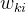 运算，矩阵运算结果再经过非线性激活函数得到隐层的结果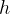, 从隐层到输出层同理

这样从输入层到输出层既有线性变换，又有非线性变换，因此可以更好刻画出输入变量的特征


## 1.2 语言模型

### 1.2.1 统计语言模型：N-gram模型

​	什么是所谓的统计语言模型(Language Model)呢？简单来说，统计语言模型就是用来计算句子概率的概率模型。计算句子概率的概率模型很多，n-gram模型便是其中的一种。

​	一般来说，语言模型都是为了使得条件概率：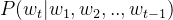最大化，不过考虑到近因效应，当前词只与距离它比较近的个词更加相关(一般不超过5)，而非前面所有的词都有关。


上述便是经典的n-gram模型的表示方式

不过，N-gram模型仍有其局限性

- 首先，由于参数空间的爆炸式增长，它无法处理更长程的context（N>3）
- 其次，它没有考虑词与词之间内在的联系性

例如，考虑"the cat is walking in the bedroom"这句话
如果我们在训练语料中看到了很多类似“the dog is walking in the bedroom”或是“the cat is running in the bedroom”这样的句子，那么，哪怕我们此前没有见过这句话"the cat is walking in the bedroom"，也可以从“cat”和“dog”（“walking”和“running”）之间的相似性，推测出这句话的概率

然而， Ngram模型做不到
这是因为Ngram本质上是将词当做一个个孤立的原子单元(atomic unit)去处理的。这种处理方式对应到数学上的形式是一个个离散的one-hot向量 (除了词典索引的下标对应的方向上是1，其余方向上都是0)
例如，对于一个大小为5的词典：{"I", "love", "nature", "language", "processing"}，其中的i、love、nature、language、processing分别对应的one-hot向量为：

| i          | 1    | 0    | 0    | 0    | 0    |
| ---------- | ---- | ---- | ---- | ---- | ---- |
| love       | 0    | 1    | 0    | 0    | 0    |
| nature     | 0    | 0    | 1    | 0    | 0    |
| language   | 0    | 0    | 0    | 1    | 0    |
| processing | 0    | 0    | 0    | 0    | 1    |

​	显然，one-hot向量的维度等于词典的大小

### 1.2.2 神经语言模型：NNLM模型

接下来，咱们来看一下什么是神经语言模型(NNLM)，NNLM最初由Bengio在2003年发表的一篇论文《A Neural Probabilistic Language Mode》中提出来的，word2vec便是从其中简化训练而来。

咱们来考虑一个词表的大小为（相当于总共有个词，词用表示，比如为一万，则是一万个词），词表里每个词的维度为，即CϵR^Nm，如果词的输入是one hot编码，则N=m，另外n表示词w的上下文中包含的词数，不超过5。

Bengio通过下面的一个三层神经网络来计算：.png)：

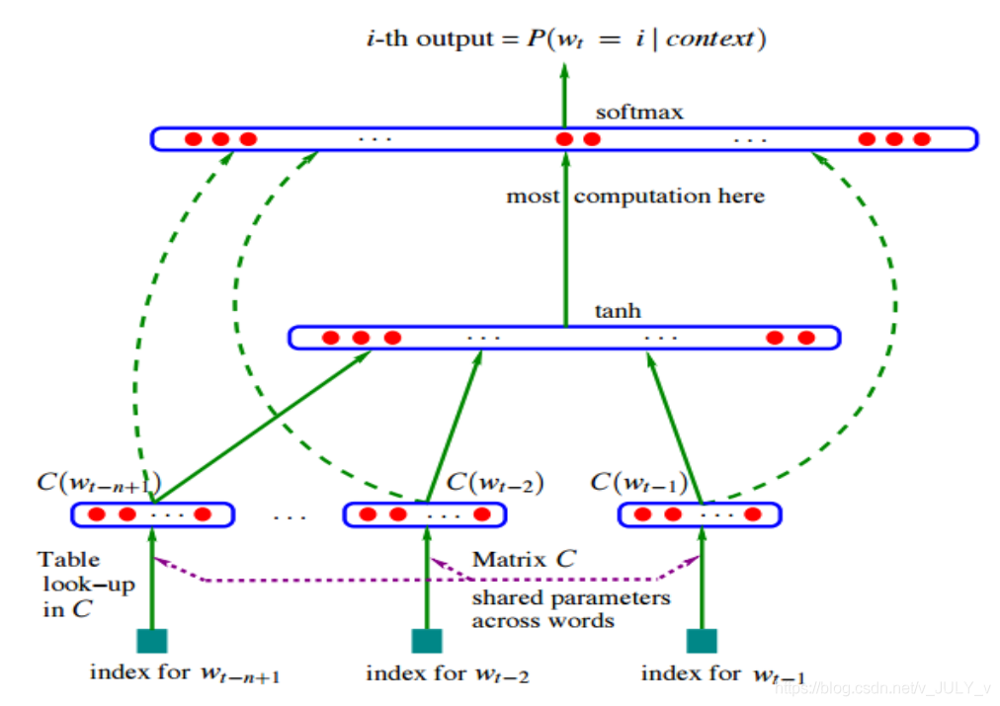

1. 首先第一层输入就是前 n-1 个词“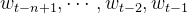”去预测第 t 个词是 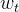  的概率；
2. 然后根据输入的前 n-1 个词，在同一个词汇表中一一找到它们对应的词向量；
3. 最后把所有词向量直接串联起来成为一个维度为 (n-1)m 的向量 x 作为接下来三层神经网络的输入 (注意这里的“串联”，其实就是 n-1 个向量按顺序首尾拼接起来形成一个长向量)
4. 隐藏层到输出层之间有大量的矩阵向量计算，在输出层之后还需要做softmax归一化计算 (使用softmax函数归一化输出之后的值是[0,1]，代表可能的每个词的概率。)


神经语言模型构建完成之后，就是训练参数了，这里的参数包括：

词向量矩阵C；
神经网络的权重；
偏置等参数
训练数据就是大堆大堆的语料库。训练结束之后，语言模型得到了：通过“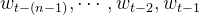”去预测第 t 个词是    的概率，但有点意外收获的是词向量“ ”也得到了。换言之，词向量是这个语言模型的副产品

当然，这个模型的缺点就是速度问题, 因为词汇表往往很大，几十万几百万，训练起来就很耗时，Bengo仅仅训练5个epoch就花了3周，这还是40个CPU并行训练的结果。因此才会有了后续好多的优化工作, word2vec便是其中一个


## 1.3NLP(自然语言处理)

​	NLP 里面，最细粒度的是词语，词语组成句子，句子再组成段落、篇章、文档。所以处理 NLP 的问题，首先就要拿词语开刀。

​	咱们居住在各个国家的人们通过各自的语言进行交流，但机器无法直接理解人类的语言，所以需要先把人类的语言“计算机化”，那如何变成计算机可以理解的语言呢？


​	我们可以从另外一个角度上考虑。举个例子，对于计算机，它是如何判断一个词的词性，是动词还是名词的呢？

​	我们有一系列样本(x,y)，对于计算机技术机器学习而言，这里的 x 是词语，y 是它们的词性，我们要构建 f(x)->y 的映射：

1. 首先，这个数学模型 f（比如神经网络、SVM）只接受数值型输入；
2. 而 NLP 里的词语，是人类语言的抽象总结，是符号形式的（比如中文、英文、拉丁文等等）；
3. 如此一来，咱们便需要把NLP里的词语转换成数值形式，或者嵌入到一个数学空间里；
4. 我们可以把文本分散嵌入到另一个离散空间，称作分布式表示，又称为词嵌入（word embedding）或词向量
5. 一种简单的词向量是one-hot encoder，其思想跟特征工程里处理类别变量的 one-hot 一样 (如之前所述，本质上是用一个只含一个 1、其他都是 0 的向量来唯一表示词语)

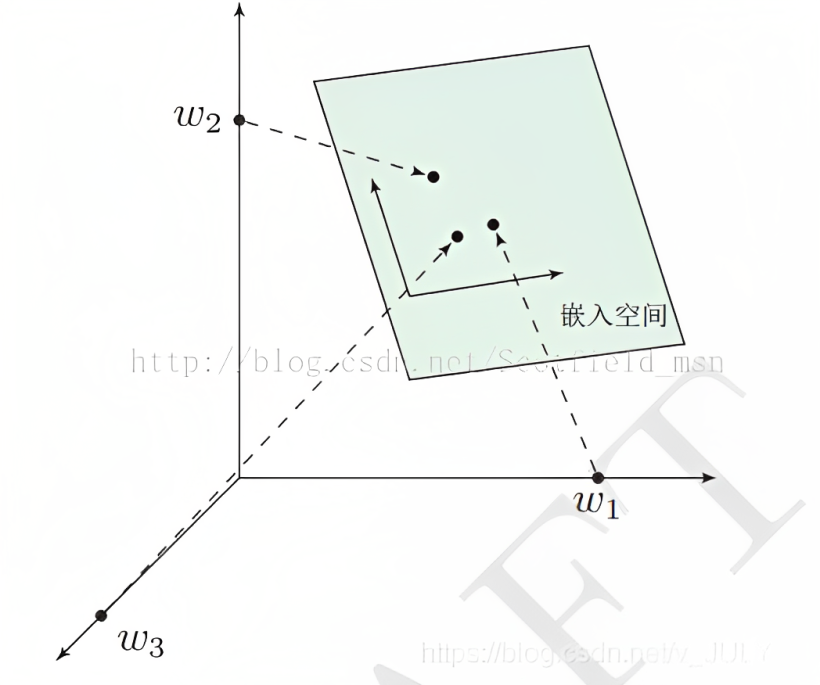

# 2.Word2Vec

​	当然，传统的one-hot 编码仅仅只是将词符号化，不包含任何语义信息。而且词的独热表示（one-hot representation）是高维的，且在高维向量中只有一个维度描述了词的语义 (高到什么程度呢？词典有多大就有多少维，一般至少上万的维度)。所以我们需要解决两个问题：1 需要赋予词语义信息，2 降低维度

这就轮到Word2Vec出场了

​	word2vec顾名思义，就是将词（word）映射到（to）实向量（vector），用一一实数向量表示一个词，也被叫做词嵌入（word embedding），也可以认为词向量是词的特征向量。通过这种词嵌入的方式可以将词语映射为可以计算的数学形式，使计算机对自然的语言的计算变得更加可行，同时也赋予了它一定的数学性质，例如可以用向量的相似度来表示两个词的相似度等等。


​	word2vec是Google研究团队里的Tomas Mikolov等人于2013年的《Distributed Representations ofWords and Phrases and their Compositionality》以及后续的《Efficient Estimation of Word Representations in Vector Space》两篇文章中提出的一种高效训练词向量的模型，*基本出发点是**上下文相似的两个词，它们的词向量也应该相似***，比如香蕉和梨在句子中可能经常出现在相同的上下文中，因此这两个词的表示向量应该就比较相似

1. 实际上，大部分的有监督机器学习模型，都可以归结为：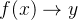

   在有些NLP问题中，把  x 看做一个句子里的一个词语，y 是这个词语的上下文词语，那么这里的 f 便是上文中所谓的『语言模型』（language model），这个语言模型的目的就是判断 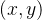 这个样本是否符合自然语言的法则，更通俗点说就是：有了语言模型之后，我们便可以判断出：x 词语  和 y 词语  放在一起，是不是人话

2. 当然，前面也说了，这个语言模型还得到了一个副产品：词向量矩阵

   而对于word2vec 而言，词向量矩阵的意义就不一样了，因为Word2Vec的最终目的不是为了得到一个语言模型，也不是要把 f 训练得多么完美，而是只**关心模型训练完后的副产物：模型参数(这里特指神经网络的权重)，并将这些参数作为输入  的某种向量化的表示，这个向量便叫做——词向量**


我们来看个例子，如何用 Word2vec 寻找相似词：

1. 对于一句话：她们 夸 吴彦祖 帅 到 没朋友，如果输入  是吴彦祖，那么  可以是：“她们、夸、帅、没朋友”这些词
2. 现有另一句话：她们 夸 我 帅 到 没朋友，如果输入  是：我，那么不难发现，这里的上下文  跟上面一句话一样
3. 从而 f(吴彦祖) = f(我) = y，所以大数据告诉我们：我 = 吴彦祖（完美的结论）

所以说，word2vec模型中比较重要的概念是词汇的上下文 (说白了就是一个词周围的词，比如的范围为1的上下文就是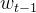和)


## 2.1word2vec模式下的两个模型：CBOW和SkipGram

### 2.1.1 2013年Mikolov的原始论文中的架构图

​	在word2vec中提出了两个模型「假设上下文窗口为3，下图来自2013年Mikolov的原始论文，注意这里没有隐藏层，只有输入层、投影层、输出层，输入层到投影层带权重，该权重对所有单词是共享的，投影层到输出层带权重」：

- *CBOW*(Continuous Bag-of-Word)：**以上下文词汇预测当前词**，即用wt−2、wt−1、wt+1、wt+2去预测 wt
- *SkipGram*：**以当前词预测其上下文词汇**，即用wt去预测wt−2、wt−1、wt+1、wt+2

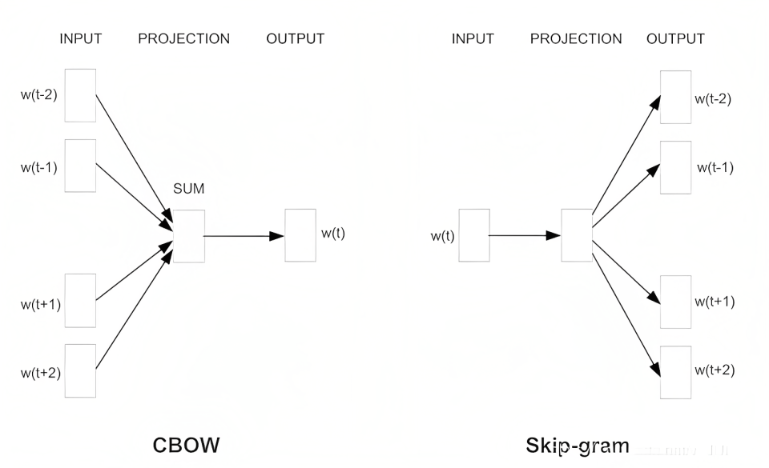


### 2.2.2 skip-gram（中心词预测上下词）

在我详细介绍skip-gram模型前，我们先来了解下训练数据的格式。skip-gram模型的输入是一个单词w I w_Iw 
I

 ，上下文的窗口大小为C CC。举个例子，这里有个句子“I drive my car to the store"。我们如果把"car"作为训练输入数据，单词组{“I”, “drive”, “my”, “to”, “the”, “store”}就是输出。所有这些单词，我们会进行one-hot编码。skip-gram模型图如下所示：

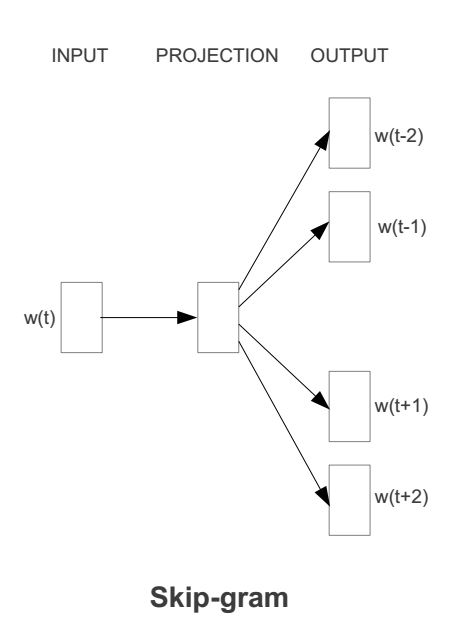


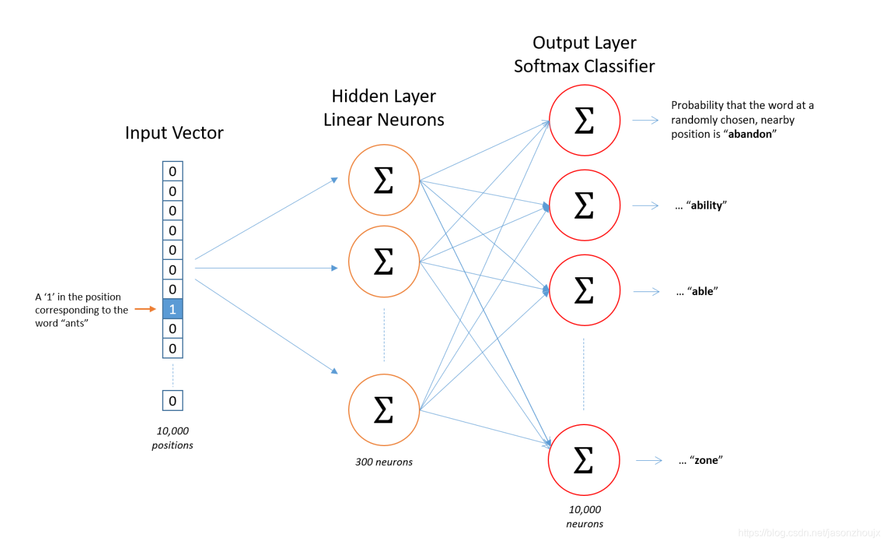

#### 2.2.2.1输入层

​	首先要将单词表示为计算机可表示的形式然后输入模型，这里仍然使用one-hot向量表示。但是开头提到one hot向量有很多问题。首先这里使用one hot向量表示单词并不需要表示出单词的之间的关系，只需要将每个单词区分开来，然后以计算机所理解的形式输入就可以了。这么做仅仅是为了解决编码问题，这里的向量并不是最终的词向量，所以没关系，可以使用onehot表示。

#### 2.2.2.2隐层

​	实际作用：降维，通过矩阵乘法将输入层输入的稀疏onehot向量降维成低维的稠密向量。

​	例如原始是10000维的onehot向量，如果想用300维的稠密向量来表示一个单词，那么隐层的权重矩阵应该为10000行，300列（隐层有300个结点）。在做矩阵乘法后就获得了一个1*300的向量，相等于通过矩阵乘法将onehot向量映射为了一个低维稠密向量，在映射之后，仍然表示原来的单词，信息量不会发生变化。

​	而最终的目的就是学习隐层的权重矩阵，通过权重矩阵与单热向量相乘就可以得到每个单词的降维后的稠密向量，这个就是词向量。这个把高维稀疏向量映射为低维稠密向量的过程就叫做嵌入，也就是词嵌入。由于矩阵运算计算量巨大，而单热向量在进行矩阵运算的时候，只有对应位置为一的那一行元素相乘不会为0，且就等于原始值，所以这个矩阵乘法就可以简化为查表的过程，将权重矩阵中与单热向量对应位置唯一的行向量选出来就是词嵌入。因此可以想到，对于一个1*10000的单热向量，会学习出一个10000*300的权重矩阵（300是一个超参数，表示词向量的维度），所以这个权重矩阵的每一维都是一个向量，也就是说为什么最终目的是为了学习这个权重矩阵，有了权重矩阵就可以计算出每个单词的向量。

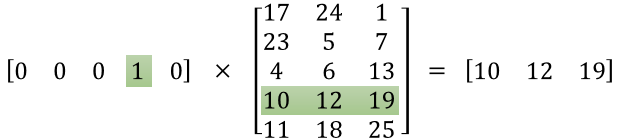


#### 2.2.2.3 输出层

​	输出层为softmax分类器，词库中的每个单词都会对应一个输出神经元，对应上面的例子，词库有10000个词，那么就有10000个输出神经元。每个输出神经元都会产生一个0-1的结果，表示输出结果为对应单词的概率是多少，这些输出神经元的输出总和为1，根据softmax的公式可以知道。就是说，每个输出神经元都有一个权重向量，这个权重向量就是所说的上下文词向量，然后将输出神经元的权重向量与中间隐层的权重向量相乘，然后求指数后归一化，将这个结果除以来自所有10,000个输出节点的结果之和，就得到了softmax的概率分布。


### 2.1.2CBOW(上下词预测中心词)


CBOW 模型训练的基本步骤包括：

1. 将上下文词进行 one-hot 表征作为模型的输入，其中词汇表的维度为 V，上下文单词数量为C；
2. 然后将所有上下文词汇的 one-hot 向量分别乘以输入层到隐层的权重矩阵W；
3. 将上一步得到的各个向量相加取平均作为隐藏层向量；
4. 将隐藏层向量乘以隐藏层到输出层的权重矩阵W’；
5. 将计算得到的向量做 softmax 激活处理得到 V 维的概率分布，取概率最大的索引作为预测的目标词

​	假设我们现在的Corpus是这一个简单的只有四个单词的document：{ I drink coffee everyday }
我们选coffee作为中心词，window size设为2，也就是说，我们要根据单词"I","drink"和"everyday"来预测一个单词，并且我们希望这个单词是coffee，而coffee的groundtruth就是coffee一开始的one-hot编码[0,0,1,0]

1.将上下文词进行 one-hot 表征作为输入：
I：        [1,0,0,0]
drink：     [0,1,0,0]
coffee：    ？
everyday： [0,0,0,1]


2.然后将 one-hot 表征结果[1,0,0,0]、[**0,1,0,0**]、[0,0,0,1]，分别乘以：3×4的输入层到隐藏层的权重矩阵W「这个矩阵也叫嵌入矩阵，可以随机初始化生成」，比如可以是
***\*1 2 3 0
1 2 1 2
-1 1 1 1\****


3.将得到的结果向量求平均作为隐藏层向量：[1, 1.67, 0.33]

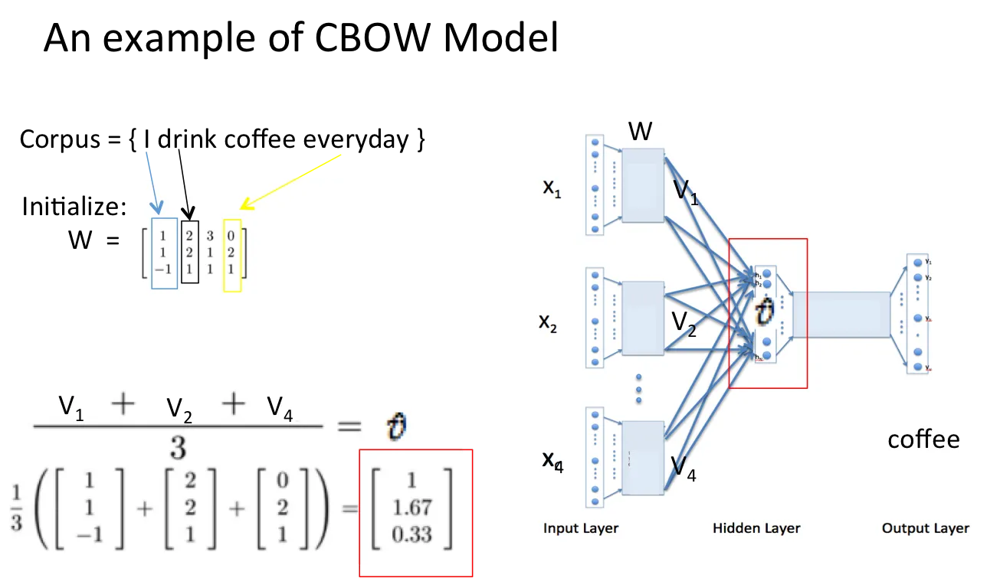

4.然后将隐藏层[1, 1.67, 0.33]向量乘以：4×3的隐藏层到输出层的权重矩阵W「这个矩阵也是嵌入矩阵，也可以初始化得到」，得到输出向量：[4.01, 2.01, 5.00, 3.34]


最后对输出向量[4.01, 2.01, 5.00, 3.34] 做 softmax 激活处理得到实际输出[0.23, 0.03, 0.62, 0.12]，并将其与真实标签[0, 0, 1, 0]做比较，然后基于损失函数做梯度优化训练

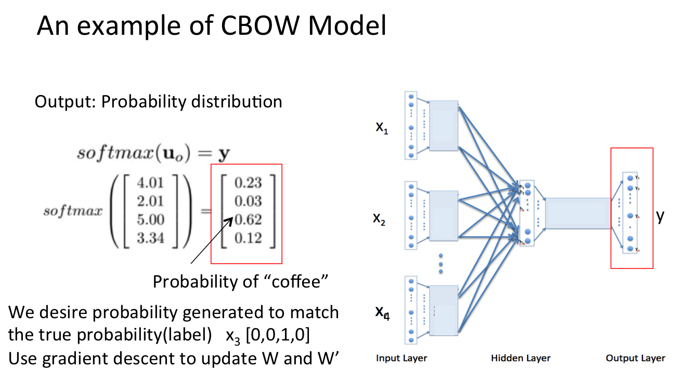

以上便是完整的 CBOW 模型计算过程，也是 word2vec 将词汇训练为词向量的基本方法之一，总结如下:

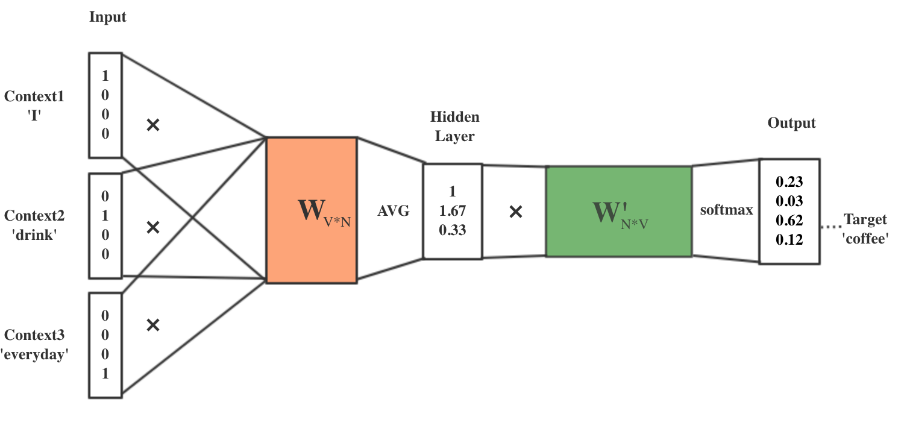


再次总结下**CBOW中对词向量(\**对应下面代码中的syn0\**)的训练步骤，如下**：

1. 读取语料，统计词频信息
2. 构建词典，并初始化Huffman树以及随机初始化每个词的对应向量（维度默认是200）
3. 以行为单位训练模型（输入文件都在一行上，会按照最大1000个词切割为多行）
4. 获取当前行中的一个输入样本（当前词向量以及相邻几个的词的词向量）
5. 累加上下文词向量中每个维度的值并求平均得到投影层向量X(w)（对应代码中的neu1）
6. 遍历当前词到根节点（输出层的Huffman树）经过的每个中间节点
7. 计算中间节点对应的梯度 g * 学习速率（与中间节点的权重向量 syn1 和投影层向量 neu1 相关）
8. 刷新投影层到该中间节点的误差向量（与梯度和中间节点向量相关）
9. 刷新中间结点向量（与梯度和投影层向量相关）
10. 刷新上下文词向量（其实就是将误差向量累加到初始向量中）

注意其中的对应关系：词向量syn0 =》投影层向量neu1 =》中间结点向量syn1，流程清晰了，coding则再不是难事：

```
word = sen[sentence_position];      //从句子中获取当前位置的词
if (word == -1) continue;           //如果获取的词是-1，就跳过这次循环
 
for (c = 0; c < layer1_size; c++) neu1[c] = 0;      //初始化隐藏层向量neu1
for (c = 0; c < layer1_size; c++) neu1e[c] = 0;     //初始化误差项向量neu1e
next_random = next_random * (unsigned long long)25214903917 + 11;  //生成新的随机数
b = next_random % window;          //将随机数对窗口大小取余，确定中心词的随机窗口大小
 
//如果使用的是cbow模型
if (cbow) {  
  // in -> hidden，输入层到隐藏层
  cw = 0;      //初始化上下文词的数量为0
 
  //在中心词周围的窗口中遍历词
  for (a = b; a < window * 2 + 1 - b; a++) if (a != window) {
    c = sentence_position - window + a;      //计算当前词的位置
    if (c < 0) continue;                     //如果当前词的位置小于0，跳过这次循环
    if (c >= sentence_length) continue;      //如果当前词的位置大于句子长度，跳过这次循环
    last_word = sen[c];                      //获取当前位置的词
 
    if (last_word == -1) continue;        //如果获取的词是-1，跳过这次循环
    //cbow 将上下文词的vector 相加，即计算上下文词的向量和
    for (c = 0; c < layer1_size; c++) neu1[c] += syn0[c + last_word * layer1_size];                      
    cw++;                                 //上下文词的数量加1
  }
 
  if (cw) {
    //将上下文词向量和进行归一化处理
    for (c = 0; c < layer1_size; c++) neu1[c] /= cw;  
 
    //hierarchical softmax
    if (hs){
      for (d = 0; d < vocab[word].codelen; d++) {
        f = 0;
        l2 = vocab[word].point[d] * layer1_size;  //计算输出层的偏移量
 
        // Propagate hidden -> output
        for (c = 0; c < layer1_size; c++) 
          f += neu1[c] * syn1[c + l2];      //计算隐藏层到输出层的传播值
        if (f <= -MAX_EXP) continue;        //如果传播值小于最小值，跳过这次循环
        else if (f >= MAX_EXP) continue;    //如果传播值大于最大值，跳过这次循环
 
        //计算sigmoid函数的输出
        else f = expTable[(int)((f + MAX_EXP) * (EXP_TABLE_SIZE / MAX_EXP / 2))];  
 
        // 'g' is the gradient multiplied by the learning rate
        // g 是梯度乘以学习速率
        g = (1 - vocab[word].code[d] - f) * alpha;  
 
        // Propagate errors output -> hidden，累计误差率
        //计算输出层到隐藏层的错误传播值
        for (c = 0; c < layer1_size; c++) neu1e[c] += g * syn1[c + l2];  
 
        // Learn weights hidden -> output
        // 更新参数权重值，根据误差更新权重
        for (c = 0; c < layer1_size; c++) syn1[c + l2] += g * neu1[c];  
      }
    }
}
```

